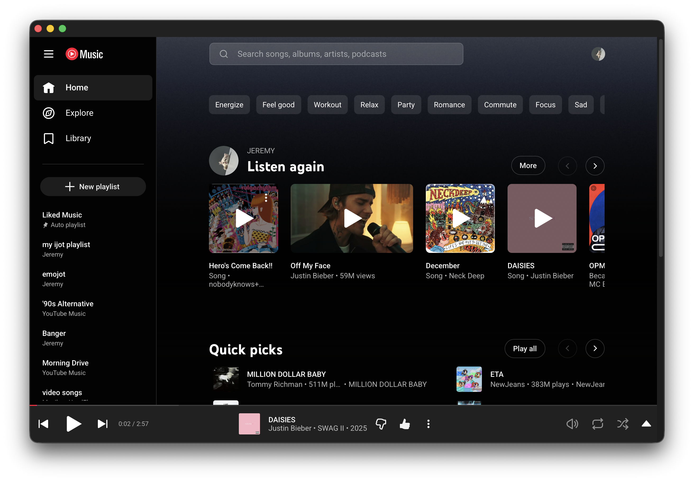
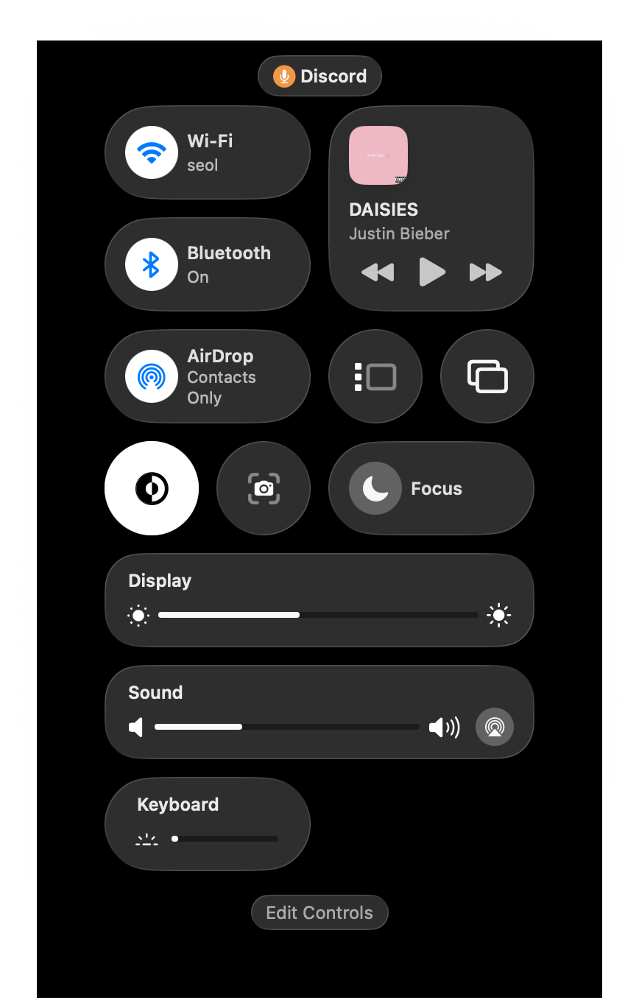
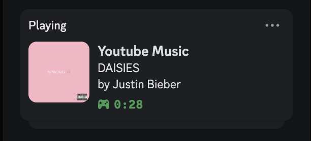

# YouTube Music for macOS

A lightweight native macOS wrapper for YouTube Music with system integration.


## Features

- **Native macOS app** — No Electron, just a lean WebKit wrapper
- **Media key support** — Control playback with your keyboard's play/pause, next, and previous keys
- **Now Playing integration** — See track info in Control Center with album artwork
- **Discord Rich Presence** — Show what you're listening to on Discord
- **Frameless design** — Clean, minimal window that blends with YouTube Music's UI
- **Native scrollbars** — macOS-style scrollbars for a consistent look

## Screenshots



| Control Center | Discord Rich Presence |
|:--------------:|:---------------------:|
|  |  |

## Installation

### Homebrew (Recommended)

```bash
brew tap 0xjemm/youtube-music-macos
brew install --cask youtube-music-macos
xattr -cr /Applications/YouTube\ Music.app
```

### Manual

1. Download the latest release from [Releases](../../releases)
2. Extract and drag to Applications
3. Run `xattr -cr /Applications/YouTube\ Music.app` (required for unnotarized apps)
4. Open and sign in to YouTube Music

### Building from Source

1. Clone the repository
2. Copy `Secrets.example.swift` to `Secrets.swift`
3. Add your [Discord Application ID](https://discord.com/developers/applications) (optional, for Discord Rich Presence)
4. Open `youtube-music-player.xcodeproj` in Xcode
5. Build and run (⌘R)

## Discord Rich Presence Setup

1. Go to [Discord Developer Portal](https://discord.com/developers/applications)
2. Create a new application
3. Copy the Application ID
4. Paste it in `Secrets.swift`

## Requirements

- macOS 26.0 or later
- Xcode 26+ (for building)

## License

MIT
